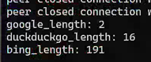

# darkweb_crawler(darkbot)
## darkweb_crawler数据库设计
### mongodb迁移指南
参考：https://blog.csdn.net/qq_23035335/article/details/99732787
```shell
# 先导出
docker exec -it xxxx /bin/bash
mongodump -u[username] -p[password] --authenticationDatabase admin 
# 再导入
docker exec -it xxxx /bin/bash
mongorestore -u[username] -p[password]--authenticationDatabase admin -d darkweb_crawler /data/logs/darkweb_crawler/darkweb_crawler/
```
### onion_list集合
| _id | source | url     | crawl_time |
|-----|--------|---------|------------|
| xxx | 索引网站   | onion网站 | xxx        |

### onion_content集合

| _id | url  | crawl_time | status      | title | head | body |
|-----|------|------------|-------------|-------|------|------|
| xxx | 当前网站 | xxxx       | 200/302/... | xxx   | xxx  | xxx  |


## 使用教程(后台运行 OR 定时启动)
注意先改名：config.ini/docker-compose.yml  
`python darkbot`查看使用简介
```shell
usage: darkbot [-h] [-u URL] [-w {from_config}] [-a {from_collection}] [-s SEARCH_KEYWORDS] [-t {from_config}]

a bot for darkweb_crawler.

options:
  -h, --help            show this help message and exit
  -u URL, --url URL     Choose a url to crawl.
  -w {from_config}, --websites_list {from_config}
                        crawl websites from config.ini and get onion list.
  -a {from_collection}, --active_crawl {from_collection}
                        active crawling for onion_url from mongodb_collection and get new onion domain.
  -s SEARCH_KEYWORDS, --search_keywords SEARCH_KEYWORDS
                        search keywords([from_config] OR [the_keywords_you_input]) in https://ahmia.fi/ and get onion_url.
  -t {from_config}, --tor2web_crawl {from_config}
                        search tor2web_keywords in google/duckduckgo/bing to get onion domain.
```
### screen后台运行
补充：**可以不用定时启动，screen太香啦！**
```shell
# 启动一个screen任务窗口
screen -S darkweb_crawler
./darkweb_crawler_run.sh
# 然后可以Ctrl+a+d挂在后台
# 查看全部screen任务
screen -ls
# 恢复screen窗口
screen -r {pid}
或者
screen -r darkweb_crawler
# 删除screen任务
exit
```
### 定时启动
```shell
# 先添加执行权限
chmod +x darkweb_crawler_run.sh
# 设置定时启动命令
crontab -e
# 然后把当前路径的telegram_crawler_run.sh添加进去
0 0 * * * /path/to/darkweb_crawler_run.sh
```

## 六种onion域名收集方式(按照"[\w]{16}.onion|[\w]{56}.onion"规则匹配域名，后续插入自行添加http或者https)
1. 基于暗网索引网站/github等网站获取onion域名(41751)  

2. 基于爬虫解析页面主动获取onion域名(完成，crawling)
3. 基于ahmia.fi暗网搜索引擎搜索关键字获取onion域名(15918,2-new)  

4. 基于torweb的搜索引擎(google/duckduckgo/bing)获取onion域名(2-16-191，由于搜索引擎存在风控，需要优化，serpapi是个好东西，可惜收费)  

5. 基于Telegram等交流工具获取onion域名(完成)
6. 基于部署具有hsdir(隐藏服务节点)标签的节点被动获取onion域名(待完成)

## 使用前配置
### mac配置tor网络
[安装参考网址，先看这个！！！](https://hanblog.fun/2021/04/07/2021-4-7-tor-simple-configer/)
```shell
brew install tor

# To start tor now and restart at login:
  brew services start tor
# Or, if you don't want/need a background service you can just run:
  /opt/homebrew/opt/tor/bin/tor

# 配置文件在：
cd /opt/homebrew/etc/tor

# 命令行使用：
export all_proxy=socks5h://127.0.0.1:9050
或者直接启动挂在后台
tor
```
### pip
`pip install -r requirements.txt`
## 记录
ahmia.fi关键词搜索才出来俩个新的
