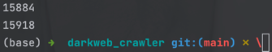
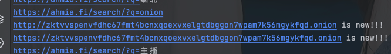

# darkweb_crawler(darkbot)
## 六种onion域名收集方式(按照"[\w]{16}.onion|[\w]{56}.onion"规则匹配域名，后续插入自行添加http或者https)
1. 基于暗网索引网站/github等网站获取onion域名(41,751)

2. 基于爬虫解析页面主动获取onion域名(crawling)
3. 基于ahmia.fi暗网搜索引擎搜索关键字获取onion域名(15918,只有2个新的)

4. 基于torweb的搜索引擎获取onion域名(待完成)
5. 基于Telegram/Twitter等交流工具获取onion域名(待完成)
6. 基于部署具有hsdir(隐藏服务节点)标签的节点被动获取onion域名(待完成)

## darkweb_crawler数据库设计
### onion_list集合
| _id | source | url     | crawl_time |
|-----|--------|---------|------------|
| xxx | 索引网站   | onion网站 | xxx        |

### onion_content集合

| _id | url  | crawl_time | status      | title | head | body |
|-----|------|------------|-------------|-------|------|------|
| xxx | 当前网站 | xxxx       | 200/302/... | xxx   | xxx  | xxx  |

## 使用前配置
### tor网络
[安装参考网址，先看这个！！！](https://hanblog.fun/2021/04/07/2021-4-7-tor-simple-configer/)
```shell
brew install tor

# To start tor now and restart at login:
  brew services start tor
# Or, if you don't want/need a background service you can just run:
  /opt/homebrew/opt/tor/bin/tor

# 配置文件在：
cd /opt/homebrew/etc/tor

# 命令行使用：
export all_proxy=socks5h://127.0.0.1:9050
或者直接启动挂在后台
tor
```
# 记录
ahmia.fi关键词搜索才出来俩个新的
